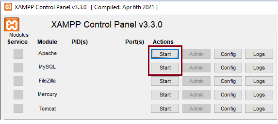
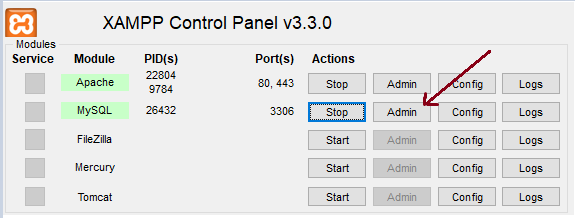
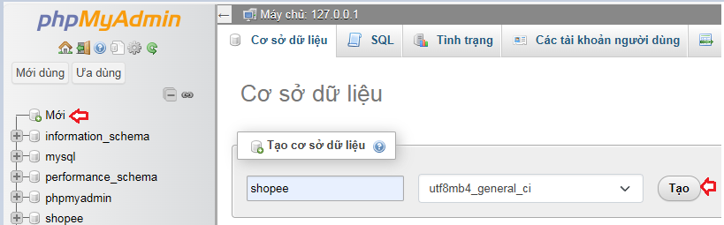
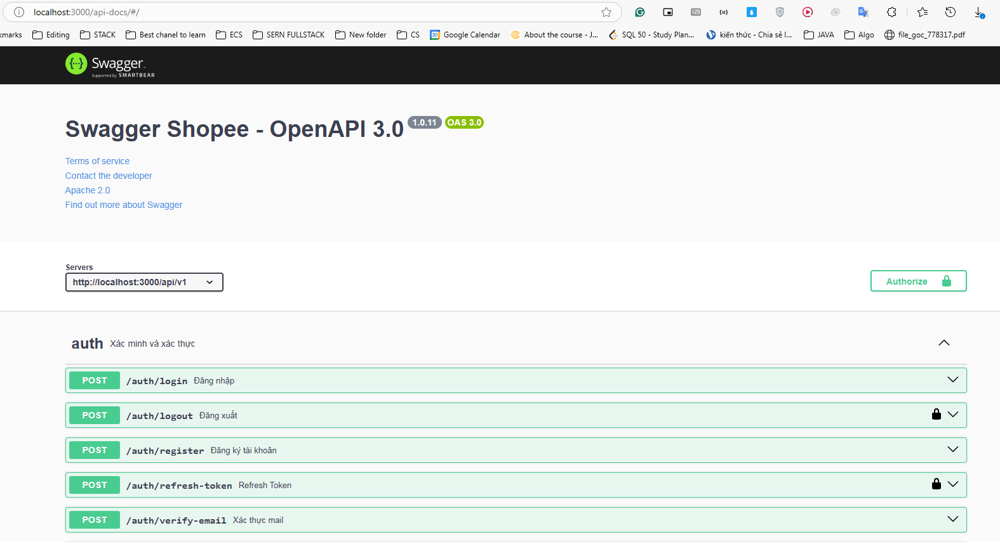

# HƯỚNG DẪN API SHOPEE DOCS

### Clone Project

```
git clone https://github.com/CNTT-UTH/Shopee-Clone-BE.git
```
### Cài đặt các packages

```
npm i
```

## Setup DATABASE
1. Tải [XAMPP](https://sourceforge.net/projects/xampp/files/XAMPP%20Windows/8.2.12/xampp-windows-x64-8.2.12-0-VS16-installer.exe)

2. Start Apache & MySQL

    

3. Mở Admin Page & tạo database tên shopee
    
    

    

4. Vào VSCode, khởi tạo database
    ```
    npm run migration:run
    ```

## Run project
```
npm run dev
```
**Notes: Nhớ tạo file .env theo .env.example**
## Truy cập [localhost:3000/api-docs](http://localhost:3000/api-docs)


